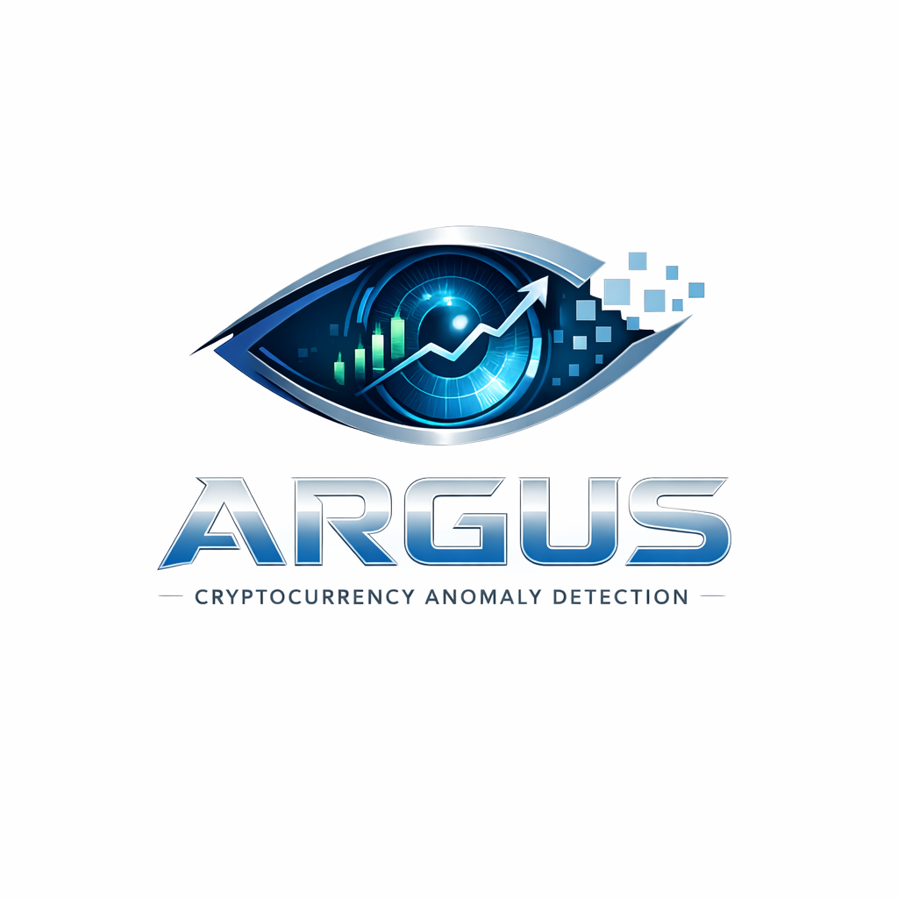
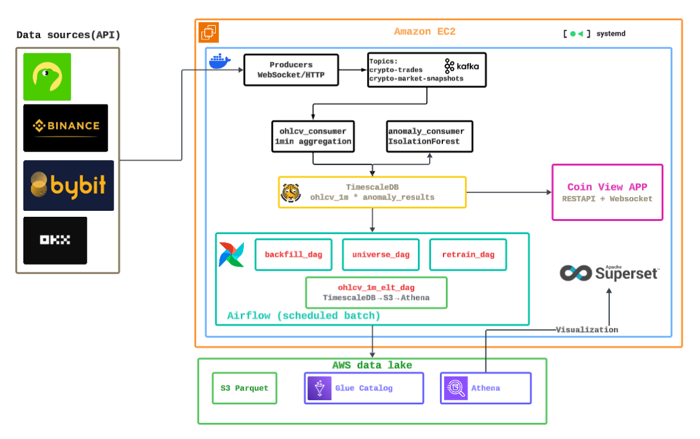
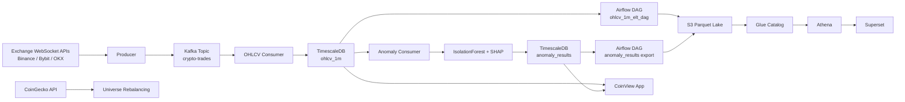
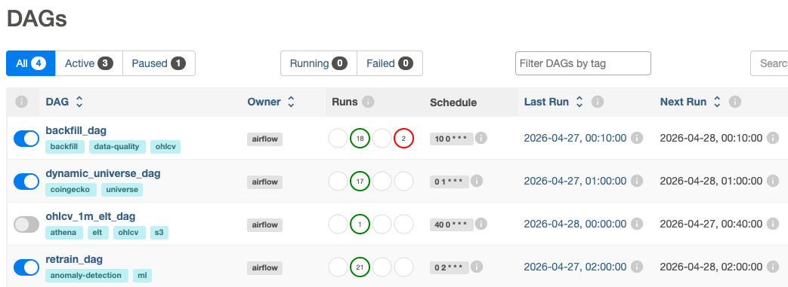
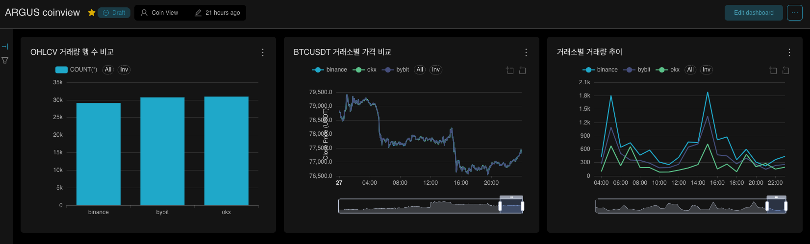
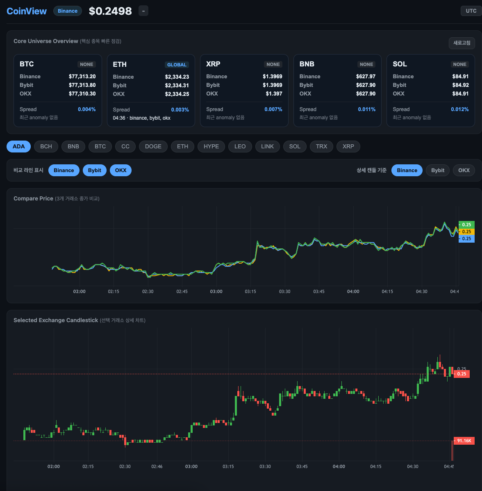
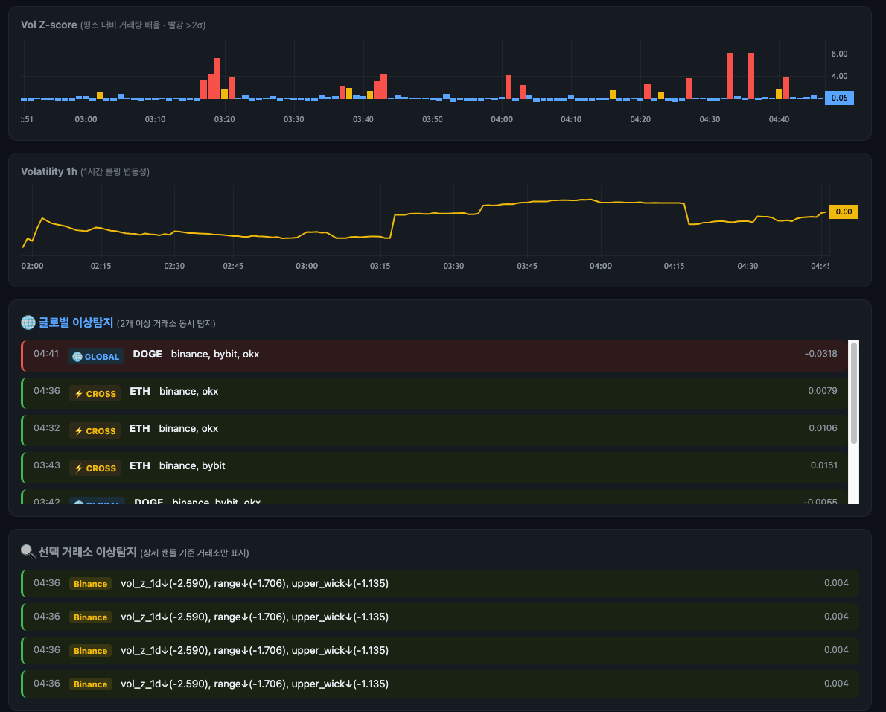

# ARGUS: 실시간 암호화폐 이상탐지 시스템

> 여러 거래소의 실시간 체결 데이터를 수집하고, 1분 단위 OHLCV로 집계한 뒤, 비지도 이상탐지 모델과 설명 가능한 AI 기법을 활용해 암호화폐 시장의 이상 징후를 탐지하는 데이터 파이프라인 프로젝트입니다.

<p align="center">
  
</p>

<br/>

## 1. 프로젝트 개요

ARGUS는 Binance, Bybit, OKX 등 여러 암호화폐 거래소의 실시간 체결 데이터를 수집하고, 이를 기반으로 거래소별 가격 변동, 거래량 변화, 변동성, 이상탐지 결과를 비교하는 프로젝트입니다.

기존 거래소 서비스는 사용자가 직접 설정한 가격 임계치에 도달했을 때 알림을 제공하는 수준에 머무르는 경우가 많습니다. 하지만 암호화폐 시장은 24시간 운영되고, 변동성이 크며, 특정 거래소의 유동성 문제나 네트워크 장애가 전체 시장 이상처럼 보일 수 있습니다.

이 프로젝트는 단순 가격 알림이 아니라, 다음 질문에 답하기 위해 시작되었습니다.

- 여러 거래소의 체결 데이터를 실시간으로 수집하고 비교할 수 있을까?
- 가격, 거래량, 변동성 기반 피처로 이상 징후를 탐지할 수 있을까?
- 단일 거래소의 이상과 시장 전체 충격을 구분할 수 있을까?
- 모델이 이상으로 판단한 근거를 사용자에게 설명할 수 있을까?

<br/>

## 2. 프로젝트 목표

1. 여러 거래소의 실시간 체결 데이터를 수집한다.
2. 수집한 데이터를 1분 단위 OHLCV로 집계한다.
3. 비지도 학습 기반 이상탐지 모델을 통해 이상 징후를 탐지한다.
4. SHAP 기반 설명을 통해 이상탐지 판단 근거를 제공한다.
5. 단일 거래소 이상과 여러 거래소에서 동시에 발생한 Global Shock을 구분한다.
6. TimescaleDB, S3, Athena, Superset을 활용해 실시간 조회와 장기 분석 환경을 분리한다.

<br/>

## 3. 문제 정의

### 3.1 기존 가격 알림의 한계

Binance, OKX, CoinGecko 등 주요 서비스는 사용자가 직접 목표 가격을 설정하고, 해당 임계치에 도달하면 알림을 제공하는 기능을 제공한다. 하지만 이러한 방식은 다음과 같은 한계가 있다.

- 사용자가 미리 임계치를 설정해야 한다.
- 단순 가격 기준이기 때문에 거래량, 변동성, 시장 맥락을 반영하기 어렵다.
- 왜 위험한지, 어떤 요인 때문에 이상으로 판단되었는지 설명하지 않는다.
- 특정 거래소의 일시적 장애와 시장 전체 충격을 구분하기 어렵다.

따라서 단순 임계치 기반 알림을 넘어, 실시간 체결 데이터 기반의 이상탐지와 설명 가능한 결과 제공이 필요하다고 판단했다.

<br/>

### 3.2 On-chain data와 Exchange data의 차이

On-chain data는 블록체인 네트워크에 기록되는 거래와 활동 데이터를 의미한다. 지갑 간 전송, 스마트컨트랙트 실행, 트랜잭션 수수료, 블록 생성 시점 등 블록체인에 직접 기록된 정보가 여기에 포함된다. 이러한 데이터는 공개 원장을 기반으로 하기 때문에 누구나 조회할 수 있고, 자금 이동이나 네트워크 활동을 분석하는 데 유용하다.

하지만 On-chain data만으로는 중앙화 거래소 내부에서 발생하는 체결가, 호가창, 거래량 변화를 tick 단위로 관찰하기 어렵다. 대부분의 사용자가 Binance, Bybit, OKX와 같은 중앙화 거래소에서 매매하더라도, 그 내부 체결 과정이 모두 블록체인에 직접 기록되는 것은 아니기 때문이다.

따라서 본 프로젝트는 On-chain data가 아니라 거래소 WebSocket API를 통해 실시간 체결 데이터를 수집하고, 거래소별 가격·거래량·이상 징후를 비교하는 방향으로 설계했다.

<br/>

### 3.3 Global Shock 구분의 필요성

여러 거래소의 암호화폐 체결 데이터를 tick 단위로 수집하는 것은 본 프로젝트의 핵심 차별점이다. 그러나 단일 거래소에서 탐지된 이상을 곧바로 시장 전체의 이상으로 해석하는 것은 위험하다.

예를 들어 특정 거래소에서 네트워크 장애, API 지연, 거래 정지, 유동성 부족이 발생하면 해당 거래소의 체결 데이터가 끊기거나 가격 갱신이 지연될 수 있다. 하지만 다른 거래소에서는 정상적으로 거래가 이루어질 수 있다. 이 경우 단일 거래소의 이상을 시장 전체의 충격으로 오해하면 사용자에게 잘못된 판단 근거를 제공할 수 있다.

따라서 본 프로젝트는 동일 심볼과 동일 1분봉 시간 구간을 기준으로 거래소별 이상탐지 결과를 비교한다.

| 구분 | 기준 | 의미 |
| --- | --- | --- |
| Local anomaly | 1개 거래소에서만 이상 탐지 | 특정 거래소의 일시적 문제 가능성 |
| Cross-exchange anomaly | 2개 거래소에서 동시에 이상 탐지 | 복수 거래소에 걸친 이상 징후 |
| Global Shock | 3개 거래소에서 동시에 이상 탐지 | 시장 전체 충격 가능성 |

이를 통해 사용자가 거래소 단위의 일시적 문제와 시장 전체 변동을 구분할 수 있도록 설계했다.

<br/>

## 4. 전체 아키텍처

<p align="center">
  
</p>



<br/>

## 5. 기술 스택

| 영역 | 기술 |
| --- | --- |
| Language | Python |
| Streaming | Apache Kafka |
| Producer | Binance WebSocket, Bybit WebSocket, OKX WebSocket, CoinGecko API |
| Consumer | Kafka Consumer |
| Time-series DB | TimescaleDB |
| Batch / Workflow | Apache Airflow |
| ML | scikit-learn IsolationForest |
| Explainability | SHAP |
| Data Lake | Amazon S3, Parquet |
| Metadata / Query | AWS Glue Catalog, Amazon Athena |
| Visualization | CoinView App, Superset |
| Infra | AWS EC2, Docker, Docker Compose, systemd |

<br/>

## 6. 핵심 컴포넌트

### 6.1 Producer

Producer는 거래소 WebSocket API를 통해 실시간 체결 데이터를 수집하고, Kafka의 `crypto-trades` topic에 메시지를 발행한다.

수집 대상 거래소는 다음과 같다.

- Binance
- Bybit
- OKX

각 거래소는 WebSocket 메시지 구조와 심볼 표기 방식이 다르기 때문에, Producer 단계에서 데이터를 공통 포맷으로 정규화한다.

예시 메시지 구조는 다음과 같다.

```json
{
  "exchange": "binance",
  "symbol": "BTCUSDT",
  "price": 65000.12,
  "quantity": 0.002,
  "timestamp": "2026-04-29T12:00:01.123Z",
  "source_type": "trade"
}
```

초기 구현에서는 각 Producer가 전역 변수로 WebSocket 상태를 관리했지만, 거래소별 WebSocket 재연결과 Universe 변경 과정에서 race condition이 발생할 수 있었다. 이를 개선하기 위해 `BaseProducer` 구조를 도입하여 거래소별 상태를 인스턴스 내부에 캡슐화했다.

<br/>

### 6.2 Kafka

Kafka는 본 프로젝트의 핵심 컴포넌트다.

초기에는 DB에 데이터를 저장한 뒤 Worker가 이를 비동기적으로 처리하는 구조도 고려했다. 하지만 수집 대상 거래소가 늘어나고, 동일한 체결 데이터를 OHLCV 집계, 이상탐지, 시각화 등 여러 처리 흐름에서 독립적으로 소비해야 한다는 점을 고려했을 때 Kafka 기반 메시지 스트리밍 구조가 더 적합하다고 판단했다.

Kafka를 도입함으로써 다음과 같은 장점을 얻을 수 있었다.

- Producer와 Consumer의 결합도 감소
- 거래소 수 증가에 따른 수집 구조 확장성 확보
- 동일 데이터를 여러 Consumer가 독립적으로 처리 가능
- 실시간 처리 파이프라인의 장애 전파 범위 감소
- 향후 알림, 저장, 모니터링 Consumer 추가 가능

<br/>

### 6.3 OHLCV Consumer

`ohlcv_consumer`는 Kafka의 `crypto-trades` topic에서 체결 데이터를 읽고, 이를 1분 단위 OHLCV로 집계한다.

OHLCV는 다음 값을 의미한다.

| 컬럼 | 의미 |
| --- | --- |
| Open | 1분 구간의 첫 체결 가격 |
| High | 1분 구간의 최고 체결 가격 |
| Low | 1분 구간의 최저 체결 가격 |
| Close | 1분 구간의 마지막 체결 가격 |
| Volume | 1분 구간의 총 거래량 |
| Trade Count | 1분 구간의 체결 수 |

집계된 데이터는 TimescaleDB의 `ohlcv_1m` 테이블에 저장된다.

<br/>

### 6.4 TimescaleDB

TimescaleDB는 실시간 OHLCV 데이터와 이상탐지 결과를 저장하는 운영 데이터베이스 역할을 한다.

암호화폐 체결 데이터는 시간 순서대로 계속 쌓이는 시계열 데이터다. 일반 PostgreSQL만 사용해도 저장은 가능하지만, 시간이 지날수록 특정 시간 구간 조회, 최근 N시간 집계, 심볼별 시계열 분석에서 성능과 관리 부담이 커질 수 있다.

TimescaleDB는 PostgreSQL 확장 기반의 시계열 데이터베이스이며, hypertable을 통해 데이터를 시간 기준 chunk로 자동 분할한다. 따라서 1분봉 OHLCV처럼 시간 범위 조회가 많은 데이터에 적합하다고 판단했다.

주요 테이블은 다음과 같다.

#### `ohlcv_1m`

| 컬럼 | 설명 |
| --- | --- |
| time | 1분봉 기준 시각 |
| exchange | 거래소 |
| symbol | 심볼 |
| open | 시가 |
| high | 고가 |
| low | 저가 |
| close | 종가 |
| volume | 거래량 |
| trade_count | 체결 수 |

#### `anomaly_results`

| 컬럼 | 설명 |
| --- | --- |
| time | 이상탐지 기준 시각 |
| exchange | 거래소 |
| symbol | 심볼 |
| anomaly_score | 이상 점수 |
| is_anomaly | 이상 여부 |
| severity | 이상 강도 |
| reason | SHAP 기반 설명 |
| ohlcv_time | 원본 OHLCV 시각 |
| detected_at | 탐지 시각 |

<br/>

### 6.5 Anomaly Consumer

`anomaly_consumer`는 TimescaleDB에 저장된 1분봉 OHLCV 데이터를 기반으로 이상탐지를 수행한다.

이상탐지 모델은 심볼과 거래소 단위로 학습되며, 최근 7일치 1분봉 데이터를 기준으로 정상 패턴을 학습한다. 이후 새롭게 들어오는 OHLCV 데이터가 기존 패턴과 얼마나 다른지를 계산하여 이상 여부를 판단한다.

<br/>

## 7. 이상탐지 모델

### 7.1 IsolationForest 선택 이유

암호화폐 이상탐지는 정상/이상 라벨을 명확히 확보하기 어렵다. 특정 급등락이 실제 이상인지, 단순한 시장 변동인지 사전에 정답으로 정의하기 어렵기 때문이다. 따라서 지도학습보다 비지도 이상탐지 방식이 적합하다고 판단했다.

IsolationForest는 데이터를 임의로 분할하면서 관측치를 고립시키는 방식으로 이상치를 탐지한다. 일반적인 데이터는 여러 번 분할해야 고립되는 반면, 이상치는 비교적 적은 분할만으로 고립되는 경향이 있다.

이 특성은 라벨 없이도 가격 변화율, 거래량 변화, 변동성 등 피처 조합에서 평소와 다른 패턴을 찾는 데 적합하다고 판단했다.

<br/>

### 7.2 피처 설계

이상탐지 모델에는 단순 가격뿐 아니라 가격 움직임, 거래량 변화, 변동성 정보를 함께 반영했다.

| 피처 | 설명 |
| --- | --- |
| `logret` | 직전 종가 대비 로그 수익률 |
| `range` | 고가와 저가의 차이를 종가로 정규화한 값 |
| `body` | 시가와 종가의 차이 |
| `upper_wick` | 캔들의 윗꼬리 길이 |
| `lower_wick` | 캔들의 아랫꼬리 길이 |
| `logvol` | 거래량 로그 변환 |
| `dlogvol` | 직전 대비 거래량 로그 변화량 |
| `vol_1h` | 최근 1시간 로그 수익률 변동성 |
| `vol_1d` | 최근 1일 로그 수익률 변동성 |
| `vol_z_1d` | 최근 1일 기준 거래량 z-score |

이를 통해 단순히 가격이 올랐는지가 아니라, 평소 대비 가격·거래량·변동성이 동시에 이례적인지를 판단할 수 있도록 했다.

<br/>

### 7.3 SHAP 기반 설명

단순히 “이상”이라고 표시하는 것만으로는 사용자가 왜 해당 구간이 이상으로 탐지되었는지 이해하기 어렵다. 따라서 모델의 판단 근거를 설명하기 위해 SHAP을 사용했다.

본 프로젝트에서는 이상탐지 결과와 함께 주요 기여 피처를 표시하여, 가격 변화율 때문인지, 거래량 급증 때문인지, 변동성 확대 때문인지 확인할 수 있도록 했다.

단, SHAP은 인과관계를 증명하는 도구가 아니라 모델 판단에 어떤 피처가 크게 기여했는지를 설명하는 도구로 사용했다.

<br/>

## 8. Core / Dynamic Universe

모든 암호화폐를 실시간으로 수집하고 이상탐지하는 것은 개인 프로젝트 환경에서는 비용과 리소스 측면에서 비효율적이다. 따라서 수집 대상을 Core Universe와 Dynamic Universe로 나누었다.

### 8.1 Core Universe

Core Universe는 BTC, ETH처럼 시장 대표성이 높고 지속적으로 모니터링해야 하는 주요 심볼이다. 이들은 시장 전체 흐름을 파악하기 위한 기준 자산 역할을 한다.

### 8.2 Dynamic Universe

Dynamic Universe는 CoinGecko 기준 시가총액 상위권 등 시장 상황에 따라 변하는 심볼 목록이다. Airflow DAG를 통해 주기적으로 최신 시장 데이터를 조회하고, 수집 대상 심볼을 갱신한다.

### 8.3 Universe 설계의 의미

이 구조는 두 가지 문제를 해결한다.

1. 제한된 서버 리소스 안에서 모든 코인을 무작정 수집하지 않고 우선순위를 정할 수 있다.
2. 시장 관심도가 변하는 암호화폐 특성을 반영하여 이상탐지 대상을 유연하게 조정할 수 있다.

<br/>

## 9. Airflow

Airflow는 배치성 작업과 주기적 관리 작업을 담당한다.

<p align="center">
  
</p>

주요 DAG는 다음과 같다.

| DAG | 역할 |
| --- | --- |
| `ohlcv_1m_elt_dag` | TimescaleDB의 1분봉 OHLCV 데이터를 S3 Parquet으로 저장 |
| `backfill_dag` | 누락된 OHLCV 데이터 보완 |
| `dynamic_universe_dag` | Dynamic Universe 심볼 갱신 |
| `retrain_dag` | 심볼별 이상탐지 모델 재학습 |

실시간 이상탐지는 Consumer가 담당하고, Airflow는 장기 보관, 누락 보완, 모델 재학습, Universe 갱신처럼 주기적으로 실행되는 작업을 담당하도록 역할을 분리했다.

<br/>

## 10. AWS Lake

TimescaleDB는 실시간 대시보드와 이상탐지 결과 저장을 위한 운영 DB 역할을 담당한다. 하지만 모든 OHLCV 데이터를 EC2 내부 DB에 장기간 저장하면 디스크 용량, 장애 복구, 분석 확장성 측면에서 한계가 있다.

이를 보완하기 위해 TimescaleDB에 적재된 `ohlcv_1m` 데이터를 주기적으로 S3에 Parquet 형식으로 저장하는 Lake 구조를 구성했다.

### 10.1 데이터 흐름

```text
TimescaleDB
  └── ohlcv_1m
        ↓ Airflow ohlcv_1m_elt_dag
S3
  └── curated/ohlcv_1m/
        ↓ Glue Crawler
Glue Data Catalog
        ↓
Athena
        ↓
Superset
```

### 10.2 S3 Parquet 저장

`ohlcv_1m_elt_dag`는 TimescaleDB에서 1분봉 OHLCV 데이터를 조회하고, 날짜와 거래소 기준으로 S3 경로에 Parquet 파일을 저장한다.

예시 S3 구조는 다음과 같다.

```text
s3://<bucket-name>/curated/ohlcv_1m/
  └── exchange=binance/
      └── event_dt=2026-04-29/
          └── part-0000.parquet
```

Parquet을 사용한 이유는 컬럼 기반 저장 형식이기 때문에 분석 쿼리에서 필요한 컬럼만 읽을 수 있고, CSV보다 저장 효율과 조회 성능 면에서 유리하기 때문이다.

### 10.3 Glue Catalog와 Athena

Glue Crawler는 S3의 Parquet 파일 구조를 읽어 Glue Data Catalog에 테이블 메타데이터를 등록한다. Athena는 Glue Catalog를 기반으로 S3 데이터를 SQL로 조회한다.

이를 통해 운영 DB인 TimescaleDB는 실시간 조회와 최근 데이터 처리에 집중하고, S3 Lake는 장기 보관·백업·분석용 저장소 역할을 하도록 분리했다.

### 10.4 Superset 시각화

Superset은 Athena에 연결되어 장기 데이터 분석과 시각화를 담당한다.

<p align="center">
  
</p>

예를 들어 다음과 같은 지표를 Superset에서 확인할 수 있다.

- 거래소별 OHLCV row count
- 심볼별 수집 누락률
- 거래소별 평균 탐지 지연 시간
- 일자별 이상탐지 발생 횟수
- Global Shock 발생 추이

<br/>

## 11. CoinView App

CoinView App은 TimescaleDB에 저장된 거래소 데이터와 이상탐지 결과를 확인할 수 있는 대시보드다.

<p align="center">
  
</p>

<p align="center">
  
</p>

주요 기능은 다음과 같다.

- 주요 심볼 요약 카드
- Binance / Bybit / OKX 가격 비교 라인 차트
- 선택 거래소 기준 캔들 차트
- 거래량 및 변동성 지표 확인
- 이상탐지 결과 조회
- Local / Cross / Global anomaly 구분
- SHAP 기반 이상탐지 설명 제공

<br/>

## 12. 운영 안정화

### 12.1 Docker

Docker는 프로젝트 실행 환경의 재현성을 확보하기 위해 사용했다.

초기에는 로컬에서 개발했지만, 실시간 데이터 수집과 Kafka, TimescaleDB, Airflow를 함께 실행하기에는 개인 PC 리소스에 한계가 있었다. 따라서 AWS EC2에서 실행하되, 로컬과 서버 환경의 차이를 줄이기 위해 Docker와 Docker Compose를 사용했다.

Docker를 통해 Kafka, Zookeeper, TimescaleDB, Airflow, Redis, PostgreSQL 등 주요 인프라를 컨테이너 단위로 관리했다.

<br/>

### 12.2 systemd

Producer와 Consumer는 실시간 데이터 수집과 처리의 핵심 프로세스이기 때문에 중단되면 전체 파이프라인이 멈춘다. 초기에는 터미널이나 tmux에서 직접 실행했지만, 장애 발생 시 자동 재시작이나 실행 상태 관리가 어렵다는 문제가 있었다.

이를 해결하기 위해 각 Producer와 Consumer를 systemd 서비스로 등록했다.

systemd 도입 효과는 다음과 같다.

- 서버 재부팅 후 자동 실행
- 프로세스 장애 시 자동 재시작
- `journalctl` 기반 로그 확인
- Kafka readiness check 이후 Consumer 실행
- 서비스별 상태 확인 및 개별 재시작 가능

특히 Kafka가 완전히 준비되기 전에 Consumer가 먼저 실행되어 실패하는 문제를 줄이기 위해 `ExecStartPre`에서 Kafka readiness check를 수행하도록 구성했다.

<br/>

## 13. 트러블슈팅

### 13.1 Kafka / Zookeeper 세션 불안정

Kafka와 Zookeeper가 함께 동작하는 구조에서 리소스 부족이나 초기화 순서 문제로 세션 타임아웃과 컨트롤러 재선출 문제가 발생했다.

개선 내용:

- Kafka readiness check 추가
- systemd `ExecStartPre`로 Kafka 준비 상태 확인
- 서비스 재시작 정책 조정
- EC2 리소스 증설
- Docker 로그 로테이션 검토

<br/>

### 13.2 WebSocket Producer race condition

초기 Producer는 모듈 전역 변수로 WebSocket 객체와 심볼 목록을 관리했다. 이 구조에서는 main thread, WebSocket thread, universe watcher thread가 같은 전역 상태에 접근하면서 race condition이 발생할 수 있었다.

개선 내용:

- `BaseProducer` 클래스 도입
- 거래소별 상태를 인스턴스 변수로 캡슐화
- WebSocket 재연결과 심볼 변경 로직 분리
- last good symbols 캐싱으로 잘못된 universe 파일 반영 방지

<br/>

### 13.3 Airflow 파일 권한 문제

Airflow 컨테이너에서 DAG가 모델 artifact나 universe 파일을 저장할 때 host volume 권한 문제로 실패하는 경우가 있었다.

개선 내용:

- host directory group 권한 조정
- Airflow 컨테이너 UID/GID 고려
- artifacts, producers 디렉터리 쓰기 권한 부여
- Airflow custom image 사용

<br/>

### 13.4 EC2 디스크 용량 부족

Kafka, Airflow, Docker 로그, TimescaleDB 데이터가 누적되면서 EC2 디스크 사용량이 빠르게 증가했다.

개선 내용:

- Docker 로그 정리
- Docker log rotation 설정 검토
- S3 Parquet Lake로 장기 데이터 분리
- TimescaleDB 보관 주기 관리 필요성 확인

<br/>

## 14. 프로젝트 구조

> 실제 repository 구조에 맞게 일부 파일명은 조정할 수 있습니다.

```text
finance_coin/
├── producers/
│   ├── base_producer.py
│   ├── binance_producer.py
│   ├── bybit_producer.py
│   ├── okx_producer.py
│   ├── coingecko_producer.py
│   ├── core_universe.json
│   ├── dynamic_universe.json
│   └── dynamic_universe_state.json
│
├── consumers/
│   ├── ohlcv_consumer.py
│   └── anomaly_consumer.py
│
├── airflow/
│   ├── docker-compose.yaml
│   ├── Dockerfile
│   └── dags/
│       ├── ohlcv_1m_elt_dag.py
│       ├── backfill_dag.py
│       ├── dynamic_universe_dag.py
│       └── retrain_dag.py
│
├── artifacts/
│   └── *.joblib
│
├── systemd/
│   ├── binance-producer.service
│   ├── bybit-producer.service
│   ├── okx-producer.service
│   ├── ohlcv-consumer.service
│   └── anomaly-consumer.service
│
├── docs/
│   └── images/
│       ├── argus_background_logo.png
│       ├── architecture.png
│       ├── coinview_app1.png
│       ├── coinview_app2.png
│       ├── dags.png
│       └── superset.png
│
├── app.py
├── anomaly_detect.py
├── config.py
├── requirements.txt
└── README.md
```

<br/>

## 15. 실행 흐름

### 15.1 인프라 실행

```bash
cd airflow
docker compose up -d
```

### 15.2 Kafka 상태 확인

```bash
docker exec airflow-kafka-1 kafka-broker-api-versions \
  --bootstrap-server localhost:9092
```

### 15.3 Producer / Consumer 실행

systemd 서비스로 실행하는 경우:

```bash
sudo systemctl start binance-producer
sudo systemctl start bybit-producer
sudo systemctl start okx-producer
sudo systemctl start ohlcv-consumer
sudo systemctl start anomaly-consumer
```

상태 확인:

```bash
sudo systemctl status binance-producer
sudo journalctl -u anomaly-consumer -f
```

### 15.4 App 실행

```bash
python app.py
```

또는 uvicorn을 사용하는 경우:

```bash
uvicorn app:app --host 0.0.0.0 --port 8000
```

<br/>

## 16. 결과 및 의의

이 프로젝트가 암호화폐 시장에서 발생하는 모든 이상 현상을 탐지할 수 있는 것은 아니다. 또한 모델이 탐지한 모든 이상 신호가 반드시 실제 위험 이벤트를 의미한다고 단정할 수도 없다.

다만 본 프로젝트는 여러 거래소의 실시간 체결 데이터를 수집하고, 이를 1분 단위 OHLCV로 집계한 뒤, 가격 변화율·거래량 변화·변동성 기반 피처를 활용해 이상 징후를 탐지하는 구조를 구현했다. 또한 단일 거래소의 이상과 여러 거래소에서 동시에 발생한 Global Shock을 구분하고, SHAP 기반 설명을 통해 모델이 어떤 변수에 주목했는지 함께 제공했다.

따라서 본 프로젝트의 의의는 모든 이상 현상을 완벽히 탐지하는 데 있지 않다. 실시간 거래소 데이터를 기반으로 이상 징후를 빠르게 포착하고, 그 판단 근거를 사용자에게 설명 가능한 형태로 제공하는 end-to-end 데이터 파이프라인을 구현했다는 점에 있다.

<br/>

## 17. 한계 및 향후 개선 방향

### 17.1 단일 EC2 구조의 한계

현재 주요 인프라는 단일 EC2 인스턴스 중심으로 구성되어 있다. 따라서 인스턴스 장애가 발생하면 Kafka, Airflow, App, Consumer가 함께 영향을 받을 수 있다.

개선 방향:

- Kafka, DB, App 서버 분리
- Managed Kafka 또는 MSK 검토
- RDS / Timescale Cloud 검토
- ECS 또는 EKS 기반 배포 구조 검토

<br/>

### 17.2 모델 단순성

현재 이상탐지 모델은 IsolationForest 기반의 비지도 모델이다. 구현과 해석은 비교적 단순하지만, 시장 체제 변화나 급격한 변동성 구간에 민감할 수 있다.

개선 방향:

- 심볼별 threshold 조정
- 거래소별 threshold 분리
- 변동성 regime별 모델 분리
- 온라인 러닝 방식 검토
- 다른 이상탐지 모델과 성능 비교

<br/>

### 17.3 알림 기능 미구현

현재는 대시보드 중심의 모니터링 구조이며, 사용자에게 실시간 알림을 보내는 기능은 제한적이다.

개선 방향:

- Slack / Discord / Telegram 알림 추가
- Global Shock 발생 시 알림
- Strong anomaly 발생 시 알림
- 동일 심볼 반복 이상 발생 시 알림

<br/>

### 17.4 데이터 품질 모니터링 보강 필요

실시간 수집 시스템에서는 이상탐지 모델만큼 데이터 품질 관리도 중요하다.

개선 방향:

- 거래소별 수집 누락률 모니터링
- OHLCV row count 검증
- Consumer lag 모니터링
- 탐지 지연 시간 측정
- Superset 기반 운영 지표 대시보드 구성

<br/>

## 18. 참고 자료

- [Amazon Athena Documentation](https://docs.aws.amazon.com/athena/)
- [AWS Glue Data Catalog and Athena](https://docs.aws.amazon.com/athena/latest/ug/data-sources-glue.html)
- [TimescaleDB Hypertable Documentation](https://docs.timescale.com/api/latest/hypertable/)
- [scikit-learn IsolationForest](https://scikit-learn.org/stable/modules/generated/sklearn.ensemble.IsolationForest.html)
- [SHAP Documentation](https://shap.readthedocs.io/)

<br/>

## 19. 작성자 메모

이 README는 프로젝트의 최종 완성 보고서라기보다, 현재까지 구현한 실시간 데이터 수집·이상탐지·시각화·데이터 레이크 구성을 정리한 문서입니다. 향후 멘토 피드백을 바탕으로 모델 검증, 알림 시스템, 인프라 분리, 데이터 품질 모니터링 부분을 보강할 예정입니다.
